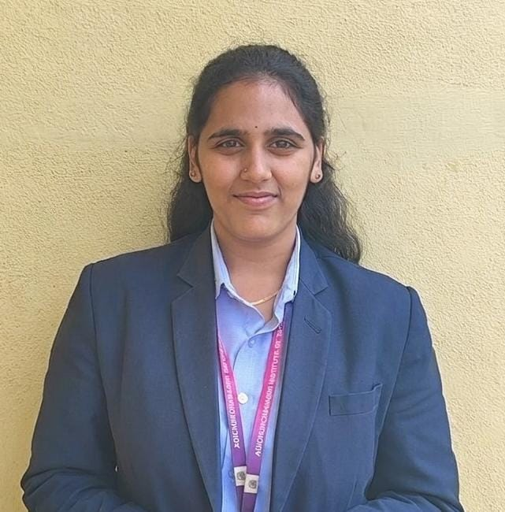

<!-- ==================== HERO ==================== -->

<table width="100%">
<tr>
<td align="center" bgcolor="#FFF0F6">

 

# Sahana C M

### Aspiring Software Engineer

💻 Java &nbsp; • &nbsp; 🐍 Python &nbsp; • &nbsp; 🌐 Web Development

Building Projects &nbsp; • &nbsp; Learning &nbsp; • &nbsp; Growing

📍 Karnataka, India &nbsp; • &nbsp; ✉️ sahanacm1720@gmail.com

 

&nbsp;

&nbsp;

  

</td>
</tr>
</table>

 

<!-- ==================== ABOUT ME ==================== -->

<table width="100%">
<tr>
<td bgcolor="#F3E8FF">

## 🌷 About Me

💻 Information Science & Engineering Graduate  
🚀 Aspiring Software Engineer  
☕ Java | 🐍 Python | 🌐 Web Development

I enjoy building practical applications, exploring new technologies,
and turning ideas into meaningful projects.

I'm continuously strengthening my programming and problem-solving
skills while growing as a software developer.

</td>
</tr>
</table>

 

<!-- ==================== TECH STACK ==================== -->

<table width="100%">
<tr>
<td align="center" bgcolor="#FFF0F6">

## 🛠️ Tech Stack

### 💻 Programming Languages

### 🌐 Frontend

### ⚙️ Backend

### 🗄️ Database

### ☁️ Cloud

### 🔧 Tools & Version Control

</td>
</tr>
</table>

 

<!-- ==================== PROJECTS ==================== -->

<table width="100%">
<tr>
<td bgcolor="#F3E8FF">

<h2 align="center">🚀 Featured Projects</h2>

 

<table width="100%">

<tr>

<!-- PROJECT 1 -->

<td width="50%" valign="top">

<h3 align="center">🌪️ Disaster SHEro</h3>

<b>Digital Disaster Preparedness & Education Platform</b>

• 📚 Interactive disaster preparedness platform  
• 🧠 AI chatbot support  
• 📝 Interactive quizzes  
• 🚨 Virtual disaster drills  
• 🔐 Secure user authentication  
• 👩‍💻 Admin dashboard for content management  
• 🌍 Region-focused preparedness features  

 

<b>Tech:</b>

`HTML` `CSS` `JavaScript`  
`Python` `Flask` `MySQL`

  

<b>Focus:</b>

Full-Stack Development · AI · Database Management

</td>

<!-- PROJECT 2 -->

<td width="50%" valign="top">

<h3 align="center">🛡️ Gramin Shield</h3>

<b>AI-Powered Digital Payment Application</b>

📅 <b>April 2026</b>

• 🔐 Secure digital transactions  
• 🌾 Designed for rural & semi-literate users  
• 🛡️ Adaptive security based on transaction value  
• 🔑 OTP authentication for high-value payments  
• 🤖 AI-based fraud detection  
• 🚨 Automatic prevention of potentially unauthorized transactions  

 

<b>Focus:</b>

`AI` `Cybersecurity`  
`Digital Payments` `Fraud Detection`

</td>

</tr>

<tr>

<!-- PROJECT 3 -->

<td width="50%" valign="top">

<h3 align="center">📚 Library Management System</h3>

<b>Java-Based Database-Driven System</b>

• 📖 Book management  
• 👤 User management  
• 🔄 Issue & return operations  
• 🗄️ Database integration  
• 📊 Transaction management  
• 🔧 CRUD operations using JDBC  

 

<b>Tech:</b>

`Java` `JDBC` `MySQL` `SQL`

  

<b>Focus:</b>

Backend Development · Database Management · JDBC

</td>

<!-- PROJECT 4 -->

<td width="50%" valign="top">

<h3 align="center">🗳️ Aadhaar-Based Blockchain E-Voting System</h3>

<b>Secure Blockchain-Based E-Voting Prototype</b>

📅 <b>May 2026</b>

• 🔐 Built a blockchain e-voting prototype  
• 🪪 Implemented Decentralized Identity (DID)  
• 🔑 Used cryptographic hashing for security  
• 🗄️ Integrated MongoDB for data management  
• 👤 Secure & anonymous voter authentication  
• ⛓️ Immutable & tamper-proof vote storage  

 

<b>Focus:</b>

`Blockchain` `Cybersecurity`  
`DID` `Cryptography` `MongoDB`

</td>

</tr>

</table>

 

<h3 align="center">☕ Java Mini Projects</h3>

A collection of Java mini-projects built using Core Java,
OOP concepts and problem-solving techniques.

<a href="https://github.com/Sahanacm17/Java-Mini-Projects">
🔗 View Repository
</a>

</td>
</tr>
</table>

 

<!-- ==================== EXPERIENCE ==================== -->

<table width="100%">
<tr>
<td bgcolor="#FFF0F6">

## 💼 Experience

### 🌸 Java Development Intern — Codveda Technologies

Completed a multi-level Java development internship focused on
hands-on programming and application development.

**Key Areas**

- ☕ Developed Java-based applications
- 🧩 Strengthened OOP and problem-solving skills
- 🗄️ Worked with JDBC and MySQL
- 💬 Explored multithreading and socket programming
- 🔧 Used Git and GitHub to manage projects

**Internship Projects**

→ Level 1 — Core Java Projects  
→ Level 2 — Java Development Projects  
→ Level 3 — Library Management System & Multithreaded Chat

</td>
</tr>
</table>

 

<!-- ==================== ACHIEVEMENTS ==================== -->

<table width="100%">
<tr>
<td bgcolor="#F3E8FF">

## 🏆 Achievements & Highlights

### 🌌 NASA Space Apps Challenge

Participated in a global collaborative challenge focused on
solving real-world problems using technology and data.

### 🔐 Cybersecurity Hackathon

Explored innovative cybersecurity solutions addressing
real-world digital security challenges.

### 🌐 NetHive Technical Club

Contributed to technical club activities, event coordination
and collaborative initiatives.

### 🎨 ICONIFY — Team Ninefinity

Participated in a team-based logo design and creative
technology activity.

</td>
</tr>
</table>

 

<!-- ==================== CERTIFICATIONS ==================== -->

<table width="100%">
<tr>
<td bgcolor="#FFF0F6">

## 📜 Certifications

### 🏅 NPTEL Certifications

- 🐍 **The Joy of Computing using Python** — NPTEL, IIT Madras
  - 🏆 **Elite | 64%**

- ☕ **Data Structures and Algorithms using Java** — NPTEL, IIT Kharagpur

- 🌐 **Computer Networks and Internet Protocol** — NPTEL, IIT Kharagpur

### ☁️ Cloud & Database

- ☁️ **Getting Started with AWS** — AWS

- 🍃 **Getting Started with MongoDB Atlas** — MongoDB

- 🔎 **Managing Atlas Vector Search Indexes** — MongoDB

</td>
</tr>
</table>

 

<!-- ==================== GITHUB STATS ==================== -->

<table width="100%">
<tr>
<td align="center" bgcolor="#F3E8FF">

<!-- ==================== GITHUB JOURNEY ==================== -->

<table width="100%">
<tr>
<td align="center" bgcolor="#F3E8FF">

<h2>📊 GitHub Journey</h2>

 

  

  

</td>
</tr>
</table>

<!-- ==================== BEYOND CODING ==================== -->

<table width="100%">
<tr>
<td align="center" bgcolor="#FFF0F6">

## 🌸 Beyond Coding

🤝 Team collaboration and communication  
🎯 Event coordination and technical activities  
🎨 Creativity and idea development  
🌱 Continuous learning and personal growth

</td>
</tr>
</table>

 

<!-- ==================== QUOTE + CONNECT ==================== -->

<table width="100%">
<tr>
<td align="center" bgcolor="#F3E8FF">

> 💻 Every repository is a step forward.  
> 🌱 Every project is an opportunity to learn.  
> 🚀 Every commit is progress.

 

## 🌸 Let's Connect

&nbsp;

&nbsp;

  

✨ Always happy to connect, collaborate and learn together.

</td>
</tr>
</table>

